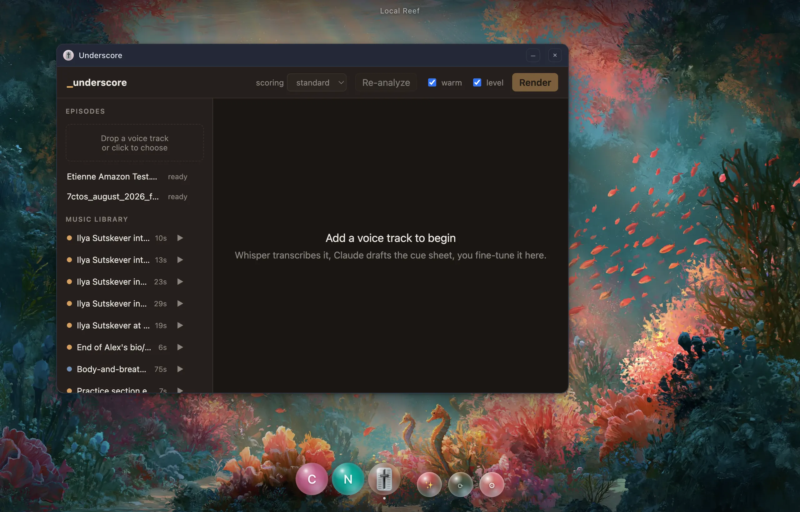

# Local Reef

A shell for local apps. Click an icon, your app opens — no terminal, no
`npm run dev`, no remembering which port anything is on.

Apps are addressed by identity, not URL: `notes`, never `localhost:5173`.



```
npm install
npm start
```

### Or install it properly

```
npm run icon        # draw assets/icon.svg into build/icon.icns
npm run build:mac   # → dist/Local Reef-darwin-arm64/Local Reef.app
```

Drag the `.app` to `/Applications` and keep it in your Dock. The build is
unsigned, so macOS will quarantine a copy that arrives from anywhere else.

Two sample apps ship in `apps/`:

| App | Type | Proves |
|---|---|---|
| **Notes** | static | serves instantly off disk, no process at all; `localStorage` persists per app origin |
| **Clock** | node server | spawned on click, proxied through the gateway, live **WebSocket** frames |

---

## Building an app by describing it

Press **⌘K**, describe what you want, hit Enter:

```
⌘K → "a pomodoro timer with session history"

  ✓ wrote index.html
  ✓ wrote reef.json
  ✓ Built pomodoro-timer-session      → 🍅 icon appears, opens
```

Takes roughly two minutes. The result is a single self-contained `index.html`
with no build step and no install, so it opens the moment it exists.

⌘K reads intent before it builds. Name something already installed ("open my
notes") and it opens instead of building a duplicate. Ask for something no
local app can do ("check my emails") and it answers in the palette — honestly,
in a sentence — rather than spending minutes building a mock inbox that can't
work. Only a genuine app description starts a build.

Needs an Anthropic API key — either `ANTHROPIC_API_KEY` in the environment, or
one saved in Settings. The Settings route matters: launched from the Dock or
Finder, a macOS app inherits no shell environment at all, so the variable is
simply absent. Generated apps are written to
`~/Library/Application Support/localreef/apps/`, never into this repo — so
`apps/` stays yours.

The model writes files through a toolset confined to that one app folder;
paths that try to escape it are refused, and a run that fails or is declined
removes the folder rather than leaving a broken icon behind.

---

## When an app breaks

The crash panel shows the real stderr, not a blank window — and a **Fix with
AI** button. It reads the app's files plus the failure, edits them in place, and
relaunches. Repairs are deliberately minimal: it fixes the failure rather than
redesigning the app.

For a **linked** project the folder is your actual checkout, so the button names
the path and takes a second, explicit click before touching anything. A fix
never deletes files, even when it fails.

---

## Running a project you already have

Drag its folder onto the desktop. Nothing is copied — the folder stays where it
is, so editing it in your editor edits what the desktop runs.

Most projects need no configuration. One that does — a Python FastAPI app whose
own entrypoint hardcodes a port — needs a three-line `reef.json` in its root:

```json
{
  "name": "Underscore",
  "type": "server",
  "run": "uv run uvicorn underscore.server:create_app --factory --host 127.0.0.1 --port $PORT --env-file .env"
}
```

`run` is a shell command with `$PORT` expanded, so any language works.

---

## Adding your own app

Drop a folder into `apps/`. There is usually nothing to configure — Local
Reef works out what it is:

```
apps/my-thing/
  index.html            → static app, served straight off disk
```

```
apps/my-thing/
  package.json          → with a "dev" or "start" script: spawned and proxied
```

Add a `reef.json` only to override something. Every field is optional:

```json
{
  "name": "Feed Reader",
  "run": "node server.js",
  "keepAlive": -1
}
```

You do not need to supply an icon. Every app gets a glass bubble whose colour
comes from its id, drawn from a palette sampled off the wallpapers, so a dock of
them looks like one set. Supply `icon.png` if you have art. Emoji work too, but
macOS renders them as detailed, mostly rectangular pictures and inside a sphere
they read as a sticker — which is why nothing bundled here uses one.

Full format: [MANIFEST.md](./MANIFEST.md). Architecture and the reasoning
behind it: [DESIGN.md](./DESIGN.md).

### What your server app gets

```
PORT             a free port, assigned for you
HOST             127.0.0.1
REEF_APP_ID   "my-thing"
REEF          "1"
```

Bind to `HOST`, not `0.0.0.0`. If your framework ignores `PORT` — Vite does —
Local Reef reads the port out of your server's startup output instead, so
it works either way.

---

## Appearance

Five wallpapers ship — two painted reefs and three CSS gradients — with a picker
in Settings. **Each background carries its own scrim.** How much darkening a
picture needs before UI text stays legible over it is a property of the picture:
one is blinding at top centre exactly where the title sits, the gradients are
already dark and need almost none. Adding one is a single entry in
`src/core/backgrounds.js` plus, for an image, a file in `assets/backgrounds/`.

The scrims are deliberately local — a strip at the top, a strip at the bottom, a
soft vignette — rather than a blanket darkening. Washing out the whole picture to
make one line of 12px text readable is a bad trade.

There is no dock panel. A rounded rectangle over a painting is a rectangle over a
painting, glass or not, so the icons float directly on the scene. App icons and
shell controls are both bubbles, built the same way: tight specular high and
left, bounce light opposite, bright rim, near-clear middle.

---

## Settings

`userData/settings.json`, holding three things the app cannot work out for
itself:

| Setting | Why it exists |
|---|---|
| **Projects folder** | scanned for apps; **opt-in per app** via a `reef.json`, because a working directory is mostly libraries and forks, not apps |
| **Anthropic API key** | a GUI launch inherits no shell environment, so `ANTHROPIC_API_KEY` is simply absent |
| **Background** | the wallpaper |

An empty `{}` is enough to opt a project into the scan. A configured key beats
the environment; the environment stays the fallback. The key itself is never
sent to the renderer — only whether one is set and where it came from.

---

## How it works

One local HTTP gateway fronts every app and routes on the hostname:

```
notes.reef.localhost  ──▶  gateway  ──▶  files on disk
clock.reef.localhost  ──▶  gateway  ──▶  127.0.0.1:51823  (spawned process)
```

Each app gets its own origin, so storage and cookies are partitioned by the
browser rather than by anything we wrote. The gateway is an HTTP server rather
than a custom `app://` protocol for one concrete reason: Chromium custom
schemes cannot carry a WebSocket, and WebSockets are how HMR works.

Requests are authenticated with a per-launch token, attached by Electron as an
`x-reef-token` header on every request bound for `*.reef.localhost` and stripped
before forwarding, so other processes on your machine can't reach your apps by
forging a `Host` header. It has to be a header rather than a cookie: an app
frame is cross-site relative to the shell, and a `SameSite=Lax` cookie is stored
and then never sent back.

---

## Development

```
npm test                 # 253 tests, including end-to-end against the real samples
npm run lint
npm run test:electron    # iframe auth in a real Electron window
npm run test:electron:ui # dock/window/settings via real Chromium input events
npm run test:electron:ws # a browser-initiated WebSocket from an app iframe
npm run test:vite        # a real Vite dev server through the gateway, incl. HMR
npm run shot             # screenshot the running app into .shots/
npm run icon             # rebuild the app icon from assets/icon.svg
npm run build:mac        # package Local Reef.app
```

`npm run shot` drives the real app over the Chrome DevTools Protocol and has it
photograph its own page, so it needs no screen-recording permission and no
test-only code in `src/main`. `npm run shot -- dock settings` captures named
states only. Point it at a packaged build with
`REEF_APP_BIN="/Applications/Local Reef.app/Contents/MacOS/Local Reef"` — worth
doing, because a GUI launch inherits no shell PATH and is a genuinely different
code path from `npm start`.

The Electron suites are separate because they need a real GUI — and they exist
because the plain suite structurally cannot catch what they cover. It
sets the `Cookie` header directly with `http.request`, which bypasses browser
cookie policy; that is exactly how a bug shipped where every app iframe got a
401. The UI suite drives `sendInputEvent` rather than `element.click()`, since
a programmatic click skips the pointer sequence and would pass happily while
the close button was broken. The WebSocket suite exists for the same reason
one layer down: every Node-driven test sets the auth header on the handshake
itself, so they all proved the gateway relays an authorised upgrade and none
proved a browser ever sends one. It did not, and every app's WebSocket was
silently dead.

The end-to-end suite starts the real `apps/clock` server, proxies it, and
asserts live WebSocket frames arrive — so a green run means the actual stack
works, not just the units.

---

## Status

Milestones 1–4 are done: registry, supervisor, gateway, the canvas, ⌘K
generation, and Fix with AI. Apps in any language run via `type: "server"`,
projects anywhere on disk can be linked in place, and a projects folder can be
scanned for anything carrying a `reef.json`.

Not built yet: live editing (M5), the `reef.*` SDK bridge, pop-out to native
windows, and intents. Outstanding work is tracked in [TODO.md](./TODO.md).

This is early software built in the open. It works, and it is not yet polished
in the places [TODO.md](./TODO.md) says it isn't.

---

## License

[MIT](./LICENSE) © Etienne de Bruin

Issues and pull requests are welcome. [DESIGN.md](./DESIGN.md) explains the
reasoning behind each architectural decision and is the right place to start —
several of them exist because the obvious approach was tried and did not work.
